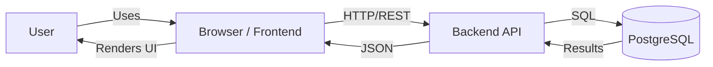

# HomePath

## App Summary

HomePath is a full-stack web application that helps people plan and track their path to homeownership. The problem it addresses is that buying a first home is complex and overwhelming: users often don’t know where to start, what steps to take, or how to track progress. The primary users are first-time or prospective home buyers who want a guided, personalized journey. The product provides a survey to capture the user’s situation and preferences, then generates a customized set of steps and todos. Users can view a timeline, manage tasks, see survey results and insights, and update their profile—all persisted in a database so progress is saved across sessions.

## Table of Contents

- [App Summary](#app-summary)
- [Tech Stack](#tech-stack)
- [Architecture Diagram](#architecture-diagram)
- [Prerequisites](#prerequisites)
- [Quick Start](#quick-start)
- [Installation & Setup](#installation--setup)
- [Running the Application](#running-the-application)
- [Verifying the Vertical Slice](#verifying-the-vertical-slice)
- [Usage](#usage)
- [Project Structure](#project-structure)
- [Application Routes](#application-routes)
- [Configuration](#configuration)
- [API](#api)
- [Testing](#testing)
- [Troubleshooting](#troubleshooting)
- [Documentation](#documentation)

## Tech Stack

Technologies by layer:

- **Frontend framework and tooling:** Vite, React, TypeScript, Tailwind CSS, shadcn/ui, React Router, TanStack Query
- **Backend framework:** Express, TypeScript, Node.js
- **Database:** PostgreSQL (database name: `homepath_db`); `pg` client in the server
- **Authentication:** JWT (jsonwebtoken) for API auth; bcrypt for password hashing; protected routes require `Authorization: Bearer <token>`
- **External services or APIs:** None; the app uses only the frontend, backend, and database above.

## Architecture Diagram



- The **user** interacts with the app in the **browser** (frontend at http://localhost:5173).
- The **frontend** sends HTTP requests to the **backend API** (http://localhost:3001/api).
- The **backend** runs SQL against **PostgreSQL** and returns JSON.
- No external third-party services are used.

## Prerequisites

Install the following and ensure they are available in your system PATH:

| Software | Purpose | Install | Verify |
|----------|---------|---------|--------|
| **Node.js** (v18+) | Runtime for frontend and backend | [Official install](https://nodejs.org/) or [nvm](https://github.com/nvm-sh/nvm) | `node -v` and `npm -v` |
| **PostgreSQL** | Database | [Official install](https://www.postgresql.org/download/) | `psql --version` |
| **psql** | CLI to create DB and run schema/seed | Included with PostgreSQL; must be in PATH | `psql --version` |

On **Windows**, the `db/` scripts are Bash-based. Use [WSL](https://docs.microsoft.com/en-us/windows/wsl/) or follow manual steps in [db/README.md](db/README.md).

## Quick Start

```sh
git clone <YOUR_GIT_URL>
cd home-path
npm install
cp .env.example .env
# Edit .env: set DB_USER, DB_PASSWORD, and JWT_SECRET
npm run db:setup
npm run dev
```

- **Frontend:** http://localhost:5173  
- **Backend API:** http://localhost:3001

## Installation & Setup

1. **Clone and install dependencies**
   ```sh
   git clone <YOUR_GIT_URL>
   cd home-path
   npm install
   ```

2. **Configure environment variables**
   - Copy `.env.example` to `.env`
   - Set database credentials: `DB_USER`, `DB_PASSWORD` (or use `DATABASE_URL`)
   - Set `JWT_SECRET` for authentication (use a long, random string in production)
   - Optional: `PORT` (backend defaults to 3001 if unset)

3. **Create the database and load schema and seed data**
   - **macOS / Linux:** Run `npm run db:setup`. This creates the database, runs `db/schema.sql`, then runs `db/seed.sql`.
   - **Windows (if Bash is not available):** Create the database, then run the SQL files manually:
     ```sh
     createdb homepath_db
     psql -d homepath_db -f db/schema.sql
     psql -d homepath_db -f db/seed.sql
     ```
   - Alternatively use only schema: `npm run db:schema`. Only seed: `npm run db:seed`. See [db/README.md](db/README.md) for more.

## Running the Application

1. **Start the backend and frontend** (from the project root):
   ```sh
   npm run dev
   ```
   This runs the Express API and the Vite dev server together. Alternatively, in two terminals:
   - `npm run dev:backend` — starts the API on port 3001
   - `npm run dev:frontend` — starts the frontend on port 5173

2. **Open the app in your browser:**  
   **http://localhost:5173**

   The backend API is at http://localhost:3001 (e.g. http://localhost:3001/api for REST endpoints).

## Verifying the Vertical Slice

Follow these steps to confirm that a user action updates the database and that the change persists after refresh.

1. **Start the app** (see [Running the Application](#running-the-application)). Open http://localhost:5173.

2. **Trigger a feature that writes to the database** — e.g. create an account:
   - Go to **Create Account** (or http://localhost:5173/create-account).
   - Fill in name, email, password (and archetype if required). Submit the form.

3. **Confirm the database was updated:**
   - In a terminal, connect to the database and check that the new user exists:
     ```sh
     psql homepath_db -c "SELECT user_id, email, username FROM user_info ORDER BY user_id DESC LIMIT 5;"
     ```
   - You should see the email you just registered.

4. **Verify persistence after refresh:**
   - In the browser, refresh the page (F5 or Ctrl+R).
   - If the app keeps you logged in (e.g. redirects to /about or dashboard), the session and user data are coming from the backend/database and the change has persisted.

You can repeat the same idea with other flows (e.g. complete a survey response, add a todo) and again check the corresponding tables in `psql` and that the UI shows the updated data after refresh.

## Usage

| Command | Description |
|--------|-------------|
| `npm run dev` | Start frontend and backend together |
| `npm run dev:frontend` | Start Vite dev server only (port 5173) |
| `npm run dev:backend` | Start Express API only (port 3001) |
| `npm run build` | Build frontend and backend for production |
| `npm run build:frontend` | Build React app only |
| `npm run build:backend` | Compile TypeScript server only |
| `npm run preview` | Serve built frontend (after `npm run build`) |
| `npm run lint` | Run ESLint |
| `npm run test` | Run frontend tests (Vitest) |
| `npm run db:setup` | Create DB, run schema and seed (Bash; see db/README on Windows) |
| `npm run db:reset` | Drop and recreate database (Bash; see db/README on Windows) |
| `npm run db:schema` | Apply schema only: `psql -d homepath_db -f db/schema.sql` |
| `npm run db:seed` | Run seed only: `psql -d homepath_db -f db/seed.sql` |

## Project Structure

```
home-path/
├── frontend/           # React + Vite app
│   └── src/
│       ├── components/ # UI and shared components
│       ├── contexts/   # Auth, Survey, etc.
│       ├── hooks/      # Custom React hooks
│       ├── lib/        # Utilities
│       ├── pages/      # Route pages
│       └── services/   # API client (e.g. api.ts)
├── server/             # Express API
│   ├── index.ts        # Server entry
│   ├── db/             # DB connection (pool)
│   ├── middleware/     # Auth (JWT)
│   └── routes/         # auth, users, surveys, todos, steps
├── db/                 # Database
│   ├── schema.sql      # Table definitions
│   ├── seed.sql        # Sample data
│   ├── setup.sh        # Setup script (Bash)
│   └── reset.sh        # Reset script (Bash)
├── .env.example        # Env template
└── package.json        # Scripts and dependencies
```

For the full directory layout, see [PROJECT_STRUCTURE.md](PROJECT_STRUCTURE.md).

## Application Routes

| Path | Description | Protected |
|------|-------------|-----------|
| `/` | Home | No |
| `/login` | Login | No |
| `/create-account` | Registration | No |
| `/about` | About | Yes |
| `/survey` | Survey | Yes |
| `/results` | Survey results | Yes |
| `/timeline` | Timeline / commit | Yes |
| `/dashboard` | Dashboard | Yes |
| `/step/:stepId` | Step detail | Yes |
| `/profile` | User profile | Yes |
| `/survey-insights` | Survey insights | Yes |
| `*` | 404 Not Found | No |

## Configuration

Environment variables are read from `.env`. Use `.env.example` as a template. Key variables:

| Variable | Description |
|----------|-------------|
| `DATABASE_URL` | Full PostgreSQL URL, or use `DB_HOST`, `DB_PORT`, `DB_NAME`, `DB_USER`, `DB_PASSWORD` |
| `PORT` | Backend server port (default: 3001) |
| `JWT_SECRET` | Secret for signing JWT tokens (required for auth) |
| `NODE_ENV` | `development` or `production` |

See [SETUP.md](SETUP.md) and `.env.example` for more detail.

## API

The backend exposes a REST API at **http://localhost:3001/api**. Main groups:

- **Auth:** `POST /api/auth/register`, `POST /api/auth/login`
- **Users:** `GET /api/users/me`, `PUT /api/users/me`
- **Surveys:** questions and responses
- **Todos:** user todo items
- **Steps:** user journey steps

Most endpoints require a JWT in the `Authorization: Bearer <token>` header. Full reference: [server/README.md](server/README.md).

## Testing

- **Frontend:** Run `npm run test` to execute Vitest tests in `frontend/`.
- **Backend:** Use curl or a tool like Postman; examples are in [SETUP.md](SETUP.md) and [server/README.md](server/README.md).

## Troubleshooting

- **Backend won’t start:** Ensure PostgreSQL is running and that port 3001 is free (e.g. `lsof -i :3001` on macOS/Linux; on Windows, check Task Manager or `netstat`).
- **Database errors:** Run `npm run db:reset` where supported, or reset manually (see [db/README.md](db/README.md)). Verify connection with `psql homepath_db`.
- **CORS errors:** Ensure the backend allows your frontend origin; see `FRONTEND_URL` in docs and server config.
- **Auth errors:** Use the `Authorization: Bearer <token>` header; tokens expire (e.g. after 24 hours).
- **Windows:** `npm run db:setup` and `npm run db:reset` use Bash scripts; use WSL or the manual steps in [db/README.md](db/README.md).

## Documentation

- [SETUP.md](SETUP.md) — Detailed setup and npm scripts
- [PROJECT_STRUCTURE.md](PROJECT_STRUCTURE.md) — Full project layout and workflow
- [INTEGRATION.md](INTEGRATION.md) — Frontend–backend integration
- [server/README.md](server/README.md) — API reference and auth
- [db/README.md](db/README.md) — Database setup and commands
