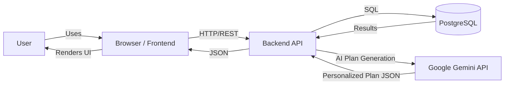

# HomePath

## App Summary

HomePath is a full-stack web application that helps people plan and track their path to homeownership. The problem it addresses is that buying a first home is complex and overwhelming: users often don’t know where to start, what steps to take, or how to track progress. The primary users are first-time or prospective home buyers who want a guided, personalized journey.

The app features an **AI-powered personalized planning system**: users complete an interactive chat-based survey (80+ questions across 9 sections covering finances, goals, and preferences), and the **Google Gemini API** analyzes their situation to generate a customized 4-step homebuying roadmap. Each plan includes detailed financial analysis (loan type recommendations, down payment calculations, savings gap, debt-to-income ratio), personalized tips, and actionable todos. The dashboard features a visual roadmap with progressive unlocking—each step unlocks only when the previous step’s todos are complete. Users can track savings progress, manage tasks, and view their financial metrics—all persisted in a database so progress is saved across sessions.

## Table of Contents

- [App Summary](#app-summary)
- [Tech Stack](#tech-stack)
- [Architecture Diagram](#architecture-diagram)
- [Prerequisites](#prerequisites)
- [Quick Start](#quick-start)
- [Installation & Setup](#installation--setup)
- [Running the Application](#running-the-application)
- [Verifying the Vertical Slice](#verifying-the-vertical-slice)
- [Usage](#usage)
- [Project Structure](#project-structure)
- [Application Routes](#application-routes)
- [Configuration](#configuration)
- [API](#api)
- [Testing](#testing)
- [Troubleshooting](#troubleshooting)
- [Documentation](#documentation)

## Tech Stack

Technologies by layer:

- **Frontend framework and tooling:** Vite, React, TypeScript, Tailwind CSS, shadcn/ui, React Router, TanStack Query
- **Backend framework:** Express, TypeScript, Node.js
- **Database:** PostgreSQL (database name: `homepath_db`); `pg` client in the server
- **Authentication:** JWT (jsonwebtoken) for API auth; bcrypt for password hashing; protected routes require `Authorization: Bearer <token>`
- **External services or APIs:** Google Gemini API (gemini-2.5-flash model) for AI-powered personalized homebuying plan generation, including financial analysis, step recommendations, tips, and actionable todos

## Architecture Diagram



The live website is deployed at [home-path.vercel.app](https://home-path.vercel.app).

- The **user** interacts with the app in the **browser** (frontend at http://localhost:5173).
- The **frontend** sends HTTP requests to the **backend API** (http://localhost:3001/api).
- The **backend** runs SQL against **PostgreSQL** and returns JSON.
- The **backend** calls **Google Gemini API** to generate AI-powered personalized homebuying plans based on survey responses.

## Prerequisites

Install the following and ensure they are available in your system PATH:

| Software                  | Purpose                              | Install                                                                         | Verify                                |
| ------------------------- | ------------------------------------ | ------------------------------------------------------------------------------- | ------------------------------------- |
| **Node.js** (v18+)        | Runtime for frontend and backend     | [Official install](https://nodejs.org/) or [nvm](https://github.com/nvm-sh/nvm) | `node -v` and `npm -v`                |
| **PostgreSQL**            | Database                             | [Official install](https://www.postgresql.org/download/)                        | `psql --version`                      |
| **psql**                  | CLI to create DB and run schema/seed | Included with PostgreSQL; must be in PATH                                       | `psql --version`                      |
| **Google Gemini API Key** | AI-powered plan generation           | Get free key at https://aistudio.google.com/app/apikey                          | Check `.env` has `GEMINI_API_KEY` set |

On **Windows**, the `db/` scripts are Bash-based. Use [WSL](https://docs.microsoft.com/en-us/windows/wsl/) or follow manual steps in [db/README.md](db/README.md).

## Quick Start

```sh
git https://github.com/jgoates1/home-path.git
cd home-path
npm install
cp .env.example .env
# Edit .env: set DB_USER, DB_PASSWORD, JWT_SECRET, and GEMINI_API_KEY
npm run db:setup
npm run dev
```

- **Frontend:** http://localhost:5173
- **Backend API:** http://localhost:3001

## Installation & Setup

1. **Clone and install dependencies**

   ```sh
   git clone https://github.com/jgoates1/home-path.git
   cd home-path
   npm install
   ```

2. **Configure environment variables**
   - Copy `.env.example` to `.env`
   - Set database credentials: `DB_USER`, `DB_PASSWORD` (or use `DATABASE_URL`)
   - Set `JWT_SECRET` for authentication (use a long, random string in production)
   - **Set `GEMINI_API_KEY` for AI plan generation (required)**:
     1. Visit https://aistudio.google.com/app/apikey
     2. Sign in with your Google account
     3. Click **"Create API Key"** (or use an existing project)
     4. Copy the generated API key
     5. Paste into `.env` as `GEMINI_API_KEY=your_key_here`

     ⚠️ **Important**: Without this key, the survey will complete but plan generation will fail with a 500 error.

   - Optional: `PORT` (backend defaults to 3001 if unset)

3. **Create the database and load schema and seed data**
   - **macOS / Linux:** Run `npm run db:setup`. This creates the database, runs `db/schema.sql`, then runs `db/seed.sql`.
   - **Windows (if Bash is not available):** Create the database, then run the SQL files manually:
     ```sh
     createdb homepath_db
     psql -d homepath_db -f db/schema.sql
     psql -d homepath_db -f db/seed.sql
     ```
     ```sh
     psql -U "YourUsername" -d homepath_db -f db/schema.sql
     psql -U "YourUsername" -d homepath_db -f db/seed.sql
     ```
   - Alternatively use only schema: `npm run db:schema`. Only seed: `npm run db:seed`. See [db/README.md](db/README.md) for more.

## Running the Application

1. **Start the backend and frontend** (from the project root):

   ```sh
   npm run dev
   ```

   This runs the Express API and the Vite dev server together. Alternatively, in two terminals:
   - `npm run dev:backend` — starts the API on port 3001
   - `npm run dev:frontend` — starts the frontend on port 5173

2. **Open the app in your browser:**  
   **http://localhost:5173**

   The backend API is at http://localhost:3001 (e.g. http://localhost:3001/api for REST endpoints).

## How It Works

HomePath guides first-time homebuyers through a personalized journey powered by AI. Here's how the app works:

### 1. Interactive Survey (Chat Interface)

After creating an account, users complete an interactive chat-based survey that collects comprehensive information about their situation:

- **9 Question Sections**:
  1. **About You**: Age, buying solo or with a partner, relationship status
  2. **Your Income**: Annual income, income type (salaried, self-employed, etc.), job stability
  3. **Your Finances**: Current savings, total assets, upcoming large expenses
  4. **Credit & Debt**: Credit score range, credit issues, monthly debt payments
  5. **Budget & Timeline**: Target home price, target state, purchase timeline
  6. **Your Goals**: Motivations, equity vs. payment priorities, how long they plan to stay, house hacking interest
  7. **The Home**: Property type, bedrooms, renovation willingness, target location, school district importance
  8. **Mindset & Readiness**: Concerns/fears, mortgage familiarity, real estate agent status
  9. **Special Situations**: Veteran status, public servant, rural area, prior foreclosure/bankruptcy

- **Smart Question Flow**:
  - Questions appear one at a time in a chat-like interface
  - Conditional logic shows/hides questions based on previous answers (e.g., co-buyer questions only appear if buying with someone)
  - Progress bar shows completion percentage
  - Takes approximately 3-4 minutes to complete

### 2. AI-Powered Plan Generation

When the survey is submitted, the backend sends the user's responses to the **Google Gemini API (gemini-2.5-flash model)** with a comprehensive 800+ line system prompt that includes:

- Homebuying best practices and guidelines
- Mortgage basics (FHA, VA, USDA, conventional loans)
- Down payment rules based on credit score
- Debt-to-income (DTI) ratio calculations
- Closing cost estimates and cash reserve recommendations
- State-specific program guidance

**The AI analyzes the user's situation and generates**:

- **Financial Metrics** (8 calculations):
  - Recommended loan type (FHA, VA, USDA, or conventional with specific down payment %)
  - Down payment amount and percentage
  - Closing cost estimate
  - Total cash needed
  - Savings gap (how much more they need to save)
  - Monthly savings target
  - Months to goal
  - Estimated monthly mortgage payment
  - Debt-to-income ratio

- **4-Step Personalized Roadmap**:
  1. **Get Your Finances Ready**
  2. **Get Pre-Approved**
  3. **Find Your Home**
  4. **Close the Deal**

  Each step includes:
  - Goal date (based on their purchase timeline)
  - 4 personalized tips (referencing their actual dollar amounts, location, and concerns)
  - 4 actionable todos (specific to their situation)

All plan data is stored in the database so it persists across sessions.

### 3. Dashboard & Progress Tracking

After plan generation, users land on their personalized dashboard featuring:

- **Visual Roadmap**: Animated SVG path showing their journey through the 4 steps
  - Steps are progressively unlocked: Step 1 is always available, but Step 2 only unlocks when all Step 1 todos are complete, and so on
  - Visual indicators show locked, active, and completed steps
  - Confetti celebration when all steps are complete

- **Savings Tracker**:
  - Shows current savings vs. total cash needed (down payment + closing costs)
  - Editable savings amount that updates the database
  - Progress bar with percentage

- **Financial Snapshot**: Displays all 8 financial metrics at a glance

- **Up Next**: Shows the top 5 incomplete todos across all steps

### 4. Step Detail Pages

Clicking on an unlocked step takes users to a detail page showing:

- Step-specific tips from the AI
- Todos with checkboxes (completion status persists to database)
- Goal date for completing the step

### Key Features

- **Personalization**: All tips and todos reference the user's actual numbers (income, savings, target price, location, timeline)
- **Smart Recommendations**: Loan type varies by credit score, veteran status, rural location, etc.
- **Reality Check**: AI warns if timeline is unrealistic or DTI exceeds safe thresholds
- **Trusted Resources**: Tips include links to CFPB, HUD, VA, USDA, Zillow, Bankrate, and educational YouTube searches
- **Progress Persistence**: All user data (survey answers, plan, todo completion, savings) is saved to PostgreSQL

## Verifying the Vertical Slice

Follow these steps to confirm that a user action updates the database and that the change persists after refresh.

1. **Start the app** (see [Running the Application](#running-the-application)). Open http://localhost:5173.

2. **Trigger a feature that writes to the database** — e.g. create an account:
   - Go to **Create Account** (or http://localhost:5173/create-account).
   - Fill in name, email, password (and archetype if required). Submit the form.

3. **Confirm the database was updated:**
   - In a terminal, connect to the database and check that the new user exists:
     ```sh
     psql homepath_db -c "SELECT user_id, email, username FROM user_info ORDER BY user_id DESC LIMIT 5;"
     ```
   - You should see the email you just registered.

4. **Verify persistence after refresh:**
   - In the browser, refresh the page (F5 or Ctrl+R).
   - If the app keeps you logged in (e.g. redirects to /about or dashboard), the session and user data are coming from the backend/database and the change has persisted.

You can repeat the same idea with other flows (e.g. complete a survey response, add a todo) and again check the corresponding tables in `psql` and that the UI shows the updated data after refresh.

## Usage

| Command                  | Description                                                     |
| ------------------------ | --------------------------------------------------------------- |
| `npm run dev`            | Start frontend and backend together                             |
| `npm run dev:frontend`   | Start Vite dev server only (port 5173)                          |
| `npm run dev:backend`    | Start Express API only (port 3001)                              |
| `npm run build`          | Build frontend and backend for production                       |
| `npm run build:frontend` | Build React app only                                            |
| `npm run build:backend`  | Compile TypeScript server only                                  |
| `npm run preview`        | Serve built frontend (after `npm run build`)                    |
| `npm run lint`           | Run ESLint                                                      |
| `npm run test`           | Run frontend tests (Vitest)                                     |
| `npm run db:setup`       | Create DB, run schema and seed (Bash; see db/README on Windows) |
| `npm run db:reset`       | Drop and recreate database (Bash; see db/README on Windows)     |
| `npm run db:schema`      | Apply schema only: `psql -d homepath_db -f db/schema.sql`       |
| `npm run db:seed`        | Run seed only: `psql -d homepath_db -f db/seed.sql`             |

## Project Structure

```
home-path/
├── frontend/           # React + Vite app
│   └── src/
│       ├── components/ # UI and shared components
│       ├── contexts/   # Auth, Survey, etc.
│       ├── hooks/      # Custom React hooks
│       ├── lib/        # Utilities
│       ├── pages/      # Route pages
│       └── services/   # API client (e.g. api.ts)
├── server/             # Express API
│   ├── index.ts        # Server entry
│   ├── db/             # DB connection (pool)
│   ├── middleware/     # Auth (JWT)
│   └── routes/         # auth, users, surveys, todos, steps
├── db/                 # Database
│   ├── schema.sql      # Table definitions
│   ├── seed.sql        # Sample data
│   ├── setup.sh        # Setup script (Bash)
│   └── reset.sh        # Reset script (Bash)
├── .env.example        # Env template
└── package.json        # Scripts and dependencies
```

For the full directory layout, see [PROJECT_STRUCTURE.md](PROJECT_STRUCTURE.md).

## Application Routes

| Path               | Description                                   | Protected |
| ------------------ | --------------------------------------------- | --------- |
| `/`                | Home                                          | No        |
| `/login`           | Login                                         | No        |
| `/create-account`  | Registration                                  | No        |
| `/about`           | About                                         | Yes       |
| `/survey`          | Interactive chat-based survey (80+ questions) | Yes       |
| `/plan-loading`    | AI plan generation in progress                | Yes       |
| `/results`         | Buyer archetype & personalized tips           | Yes       |
| `/timeline`        | Timeline commitment                           | Yes       |
| `/dashboard`       | Main hub with roadmap & progress tracking     | Yes       |
| `/step/:stepId`    | Step detail with tips and todos               | Yes       |
| `/profile`         | User profile                                  | Yes       |
| `/survey-insights` | Financial snapshot                            | Yes       |
| `*`                | 404 Not Found                                 | No        |

## Configuration

Environment variables are read from `.env`. Use `.env.example` as a template. Key variables:

| Variable         | Description                                                                                                     |
| ---------------- | --------------------------------------------------------------------------------------------------------------- |
| `DATABASE_URL`   | Full PostgreSQL URL, or use `DB_HOST`, `DB_PORT`, `DB_NAME`, `DB_USER`, `DB_PASSWORD`                           |
| `PORT`           | Backend server port (default: 3001)                                                                             |
| `JWT_SECRET`     | Secret for signing JWT tokens (required for auth)                                                               |
| `GEMINI_API_KEY` | Google Gemini API key for AI plan generation (required). Get free key at https://aistudio.google.com/app/apikey |
| `NODE_ENV`       | `development` or `production`                                                                                   |

See [SETUP.md](SETUP.md) and `.env.example` for more detail.

## API

The backend exposes a REST API at **http://localhost:3001/api**. Main endpoints:

- **Auth:**
  - `POST /api/auth/register` - Create new account
  - `POST /api/auth/login` - Login and receive JWT token

- **Users:**
  - `GET /api/users/me` - Get current user profile
  - `PUT /api/users/me` - Update user profile
  - `PUT /api/users/savings` - Update current savings amount

- **Surveys & Plans:**
  - `POST /api/surveys/generate-plan` - Generate AI-powered homebuying plan from survey responses
  - `GET /api/surveys/plan` - Fetch user's existing plan with financial metrics and steps

- **Todos:**
  - `PUT /api/todos/ai/{todoId}` - Toggle AI-generated todo completion status

- **Steps:**
  - `GET /api/steps` - Get all steps for user
  - `GET /api/steps/{stepId}` - Get specific step details
  - `POST /api/steps` - Create custom step
  - `PUT /api/steps/{stepId}` - Update step
  - `DELETE /api/steps/{stepId}` - Delete step
  - `GET /api/steps/{stepId}/todos` - Get todos for a step

Most endpoints require a JWT in the `Authorization: Bearer <token>` header. Full reference: [server/README.md](server/README.md).

## Testing

- **Frontend:** Run `npm run test` to execute Vitest tests in `frontend/`.
- **Backend:** Use curl or a tool like Postman; examples are in [SETUP.md](SETUP.md) and [server/README.md](server/README.md).

## Troubleshooting

- **Backend won’t start:** Ensure PostgreSQL is running and that port 3001 is free (e.g. `lsof -i :3001` on macOS/Linux; on Windows, check Task Manager or `netstat`).
- **Database errors:** Run `npm run db:reset` where supported, or reset manually (see [db/README.md](db/README.md)). Verify connection with `psql homepath_db`.
- **Gemini API errors:**
  - If you see "Gemini is not configured" or plan generation fails with a 500 error, verify `GEMINI_API_KEY` is set in your `.env` file.
  - Check that your API key is valid at https://aistudio.google.com/app/apikey
  - The free tier has rate limits; if you hit them, wait a few minutes or upgrade to a paid tier.
  - Ensure the `@google/generative-ai` package is installed (`npm install` should handle this).
- **CORS errors:** Ensure the backend allows your frontend origin; see `FRONTEND_URL` in docs and server config.
- **Auth errors:** Use the `Authorization: Bearer <token>` header; tokens expire (e.g. after 24 hours).
- **Windows:** `npm run db:setup` and `npm run db:reset` use Bash scripts; use WSL or the manual steps in [db/README.md](db/README.md).

## Documentation

- [SETUP.md](SETUP.md) — Detailed setup and npm scripts
- [PROJECT_STRUCTURE.md](PROJECT_STRUCTURE.md) — Full project layout and workflow
- [INTEGRATION.md](INTEGRATION.md) — Frontend–backend integration
- [server/README.md](server/README.md) — API reference and auth
- [db/README.md](db/README.md) — Database setup and commands

## EARS Requirements

**Done:**

- There shall be a page explaining what the product does.
- When a user updates their savings, the system shall update that users savings amount in the database.
- The system shall display the current user's savings amount.
- A user shall be able to create an account.
- The system shall be deployed using vercel.
- When a user checks a to-do item, the system shall save the done status in the database.
- There shall be a questionnaire for the user.
- When a user fills out the questionnaire, the system shall save their answers to the database.
- If a user has already filled out the questionnaire, the system shall not prompt them to answer the questions again when they log in.
- When the user finishes the survey, the system shall make a user's profile.
- When the user finishes the survey, the system shall generate custom suggestions with ai.

**Not Done:**
